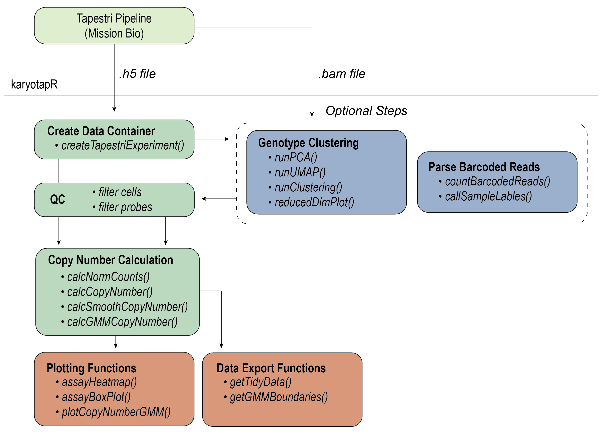

<!-- README.md is generated from README.Rmd. Please edit that file -->

```{r, include = FALSE}
knitr::opts_chunk$set(
  collapse = TRUE,
  comment = "#>",
  fig.path = "man/figures/README-",
  out.width = "100%"
)
```

# karyotapR

<!-- badges: start -->
[](https://github.com/joeymays/karyotapR/actions/workflows/R-CMD-check.yaml)
[](https://CRAN.R-project.org/package=karyotapR)
<!-- badges: end -->

karyotapR enables analysis of DNA copy number (aneuploidy) using data produced by the KaryoTap method. Users can easily parse, manipulate, and visualize datasets produced from the automated 'Tapestri Pipeline', with support for normalization, clustering, and copy number calling. Functions are also available to deconvolute multiplexed samples by genotype and parsing barcoded reads from exogenous lentiviral constructs.

KaryoTap combines custom genome-wide targeted DNA sequencing panels for the Mission Bio Tapestri system with a Gaussian mixture model framework for calling copy number.

## References

Mays JC et al., 2023. _KaryoTap Enables Aneuploidy Detection in Thousands of Single Human Cells._ https://www.biorxiv.org/content/10.1101/2023.09.08.555746v1. 

## Installation

You can install the current stable version of karyotapR from
[CRAN](https://cran.r-project.org/package=karyotapR) with:

```r
install.packages('karyotapR')
```

You can install the development version of karyotapR from [GitHub](https://github.com/joeymays/karyotapR) with:

``` r
# install.packages("devtools")
devtools::install_github("joeymays/karyotapR")
```

## Workflow

For details on the workflow, see the [Getting Started](https://joeymays.xyz/karyotapR/articles/karyotapR.html) guide, articles on this site, and the package reference/documentation.



