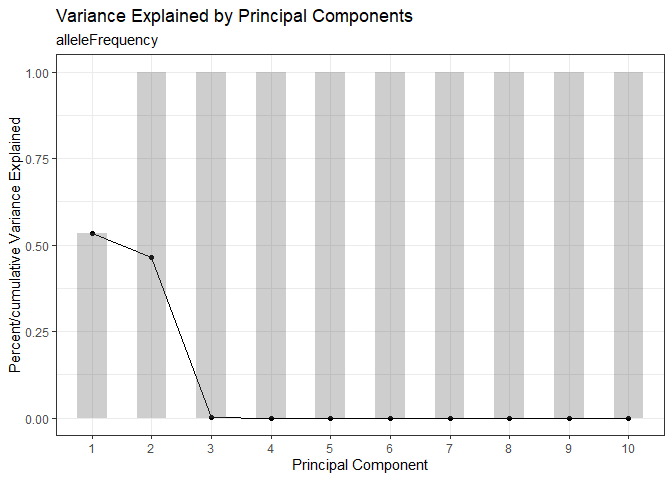
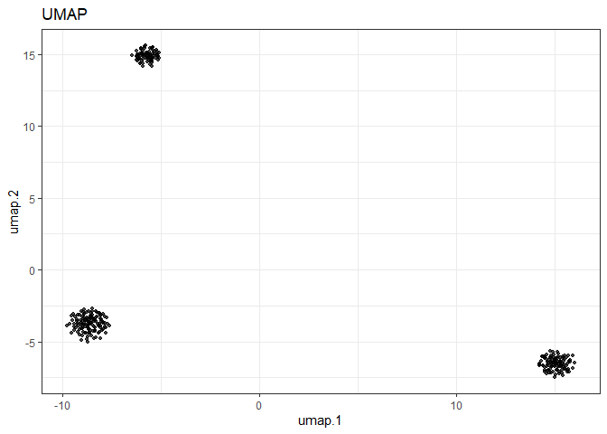
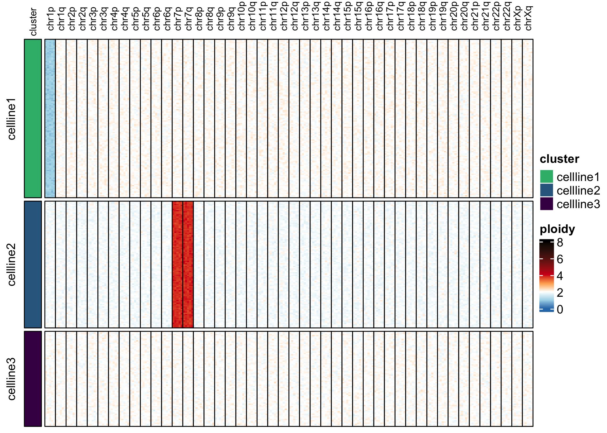
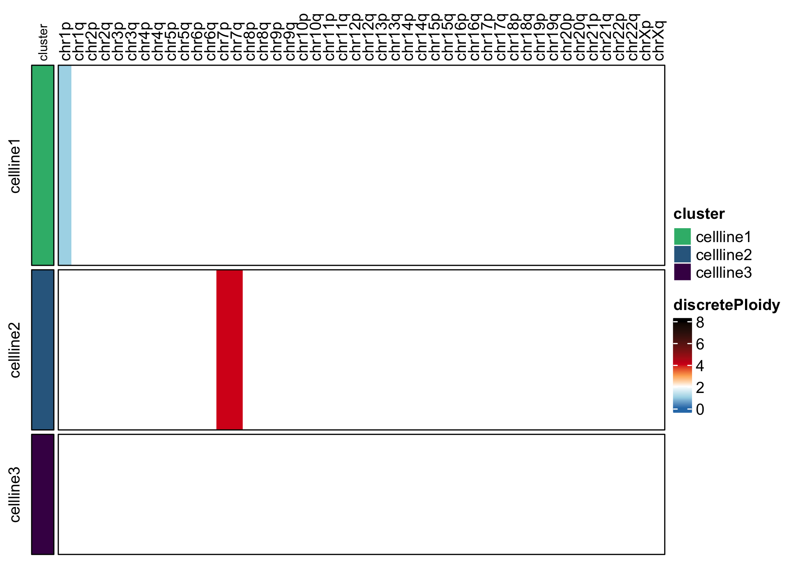
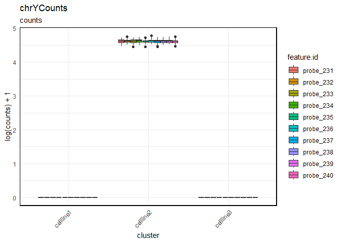

<!-- README.md is generated from README.Rmd. Please edit that file -->

# CNweaveR

<!-- badges: start -->

[](https://github.com/joeymays/CNweaveR/actions/workflows/R-CMD-check.yaml)
<!-- badges: end -->

CNweaveR enables basic analysis of CNVs using custom genome-wide
targeted DNA sequencing panels for the Mission Bio Tapestri system.

## Installation

You can install the development version of CNweaveR from
[GitHub](https://github.com/) with:

``` r
# install.packages("devtools")
devtools::install_github("joeymays/CNWeaveR")
```

## Basic Usage

### Data Import

In practice, the dataset is imported from the `.h5` file that is
generated by the Tapestri Pipeline.

``` r
library(CNweaveR)
library(forcats)
```

``` r
## NOT RUN
example.exp <- createTapestriExperiment(h5.filename)
```

We’ll use a toy dataset for this example.

``` r
example.exp <- newTapestriExperimentExample()
#> Moving chrY probe(s) probe_231, probe_232, probe_233, probe_234, probe_235, probe_236, probe_237, probe_238, probe_239, probe_240 to altExp slot 'chrYCounts'.
```

### Clustering

We cluster on allele frequency to partition different cell lines
represented in the experiment. First, run PCA and use the knee plot to
identify the PCs accounting for the most variation in the dataset.

``` r
example.exp <- runPCA(example.exp)
#> Running PCA on: alleleFrequency alleleFrequency
PCAKneePlot(example.exp)
```



Run UMAP with the top PCs.

``` r
example.exp <- runUMAP(example.exp, pca.dims = 1:2)
#> Running UMAP on: alleleFrequency alleleFrequency
```

``` r
reducedDimPlot(example.exp, dim.reduction = "umap")
```



Run `getClusters()` to cluster with dbscan.

``` r
example.exp <- getClusters(example.exp, eps = 0.9)
#> Finding clusters using on: alleleFrequency UMAP
```

Visualize UMAP, using “cluster” label to color.

``` r
reducedDimPlot(example.exp, dim.reduction = "umap", group.label = "cluster")
```


Rename cluster labels by renaming the factor levels of “cluster”. The
`forcats` package makes this easy.

``` r
colData(example.exp)$cluster <- forcats::fct_recode(colData(example.exp)$cluster, cellline1 = "1", cellline2 = "2", cellline3 = "3")
```

## Ploidy Calculation

Normalize counts and calculate ploidy relative to cellline 3, which is
diploid. `control.copy.number` gives the cluster label and ploidy value
to normalize each chromosome arm to.

``` r
example.exp <- calcNormCounts(example.exp)
control.copy.number <- generateControlCopyNumberTemplate(example.exp, sample.label.all = "cellline3", copy.number.all = 2)
example.exp <- calcCopyNumber(example.exp, control.copy.number = control.copy.number, sample.category = "cluster")
example.exp <- calcSmoothCopyNumber(example.exp)
```

Visualize ploidy. Visualization reveals that cell line 1 has 1 copy of
chromosome arm 1p, and cell line 2 has three copies of chromosome 7.

``` r
assayHeatmap(example.exp, assay = "copyNumber", split.col.by = "arm", split.row.by = "cluster", annotate.row.by = "cluster", color.preset = "ploidy")
```



``` r
assayHeatmap(example.exp, alt.exp = "smoothedCopyNumberByArm", assay = "discreteCopyNumber", split.row.by = "cluster", annotate.row.by = "cluster", color.preset = "ploidy")
```



Visualize chrY counts. Visualization reveals that cellline 2 has chr Y
and is therefore male, while the other two cell lines are female.

``` r
assayBoxPlot(example.exp, alt.exp = "chrYCounts", split.features = T, split.x.by = "cluster")
```


