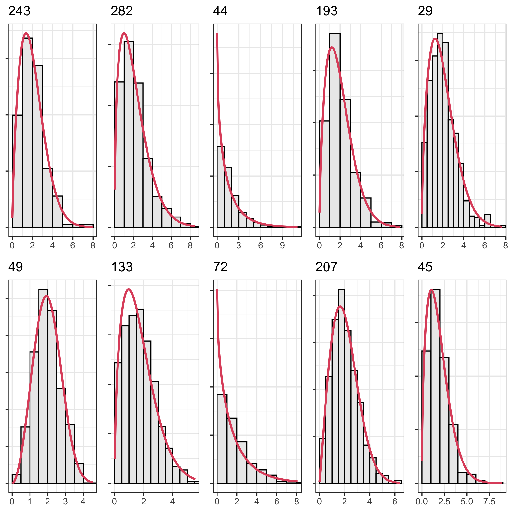
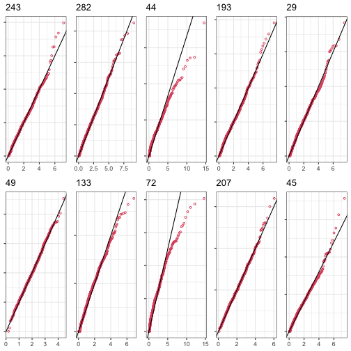
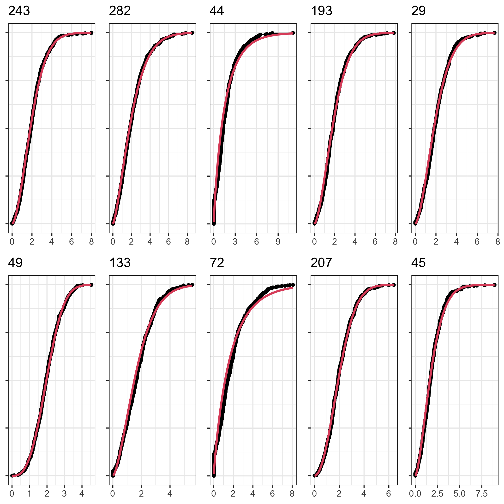
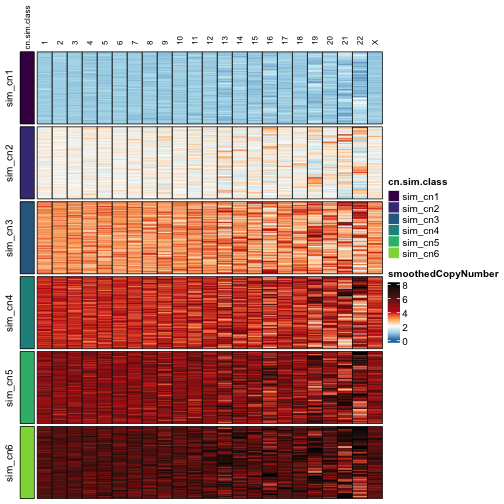
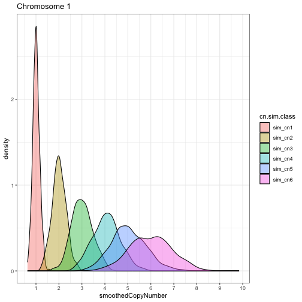
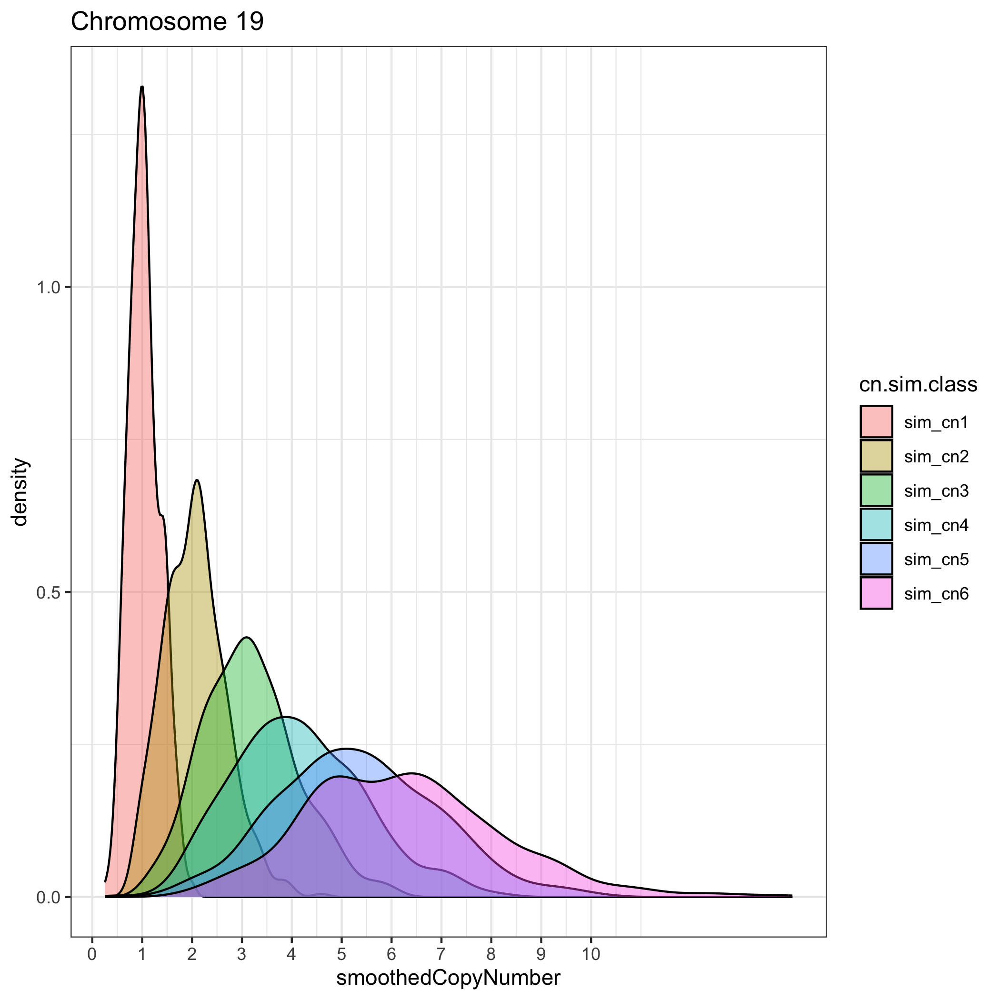
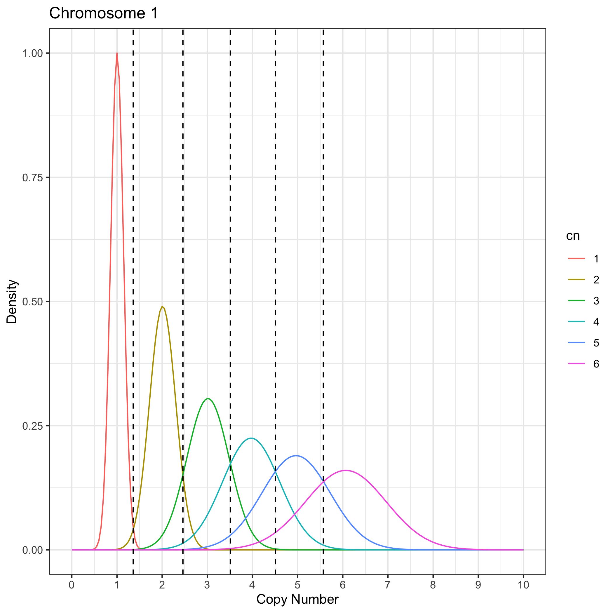
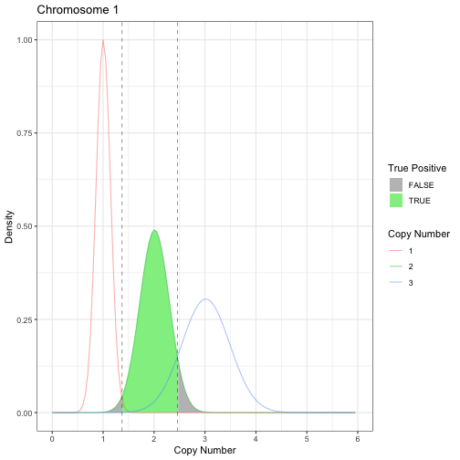
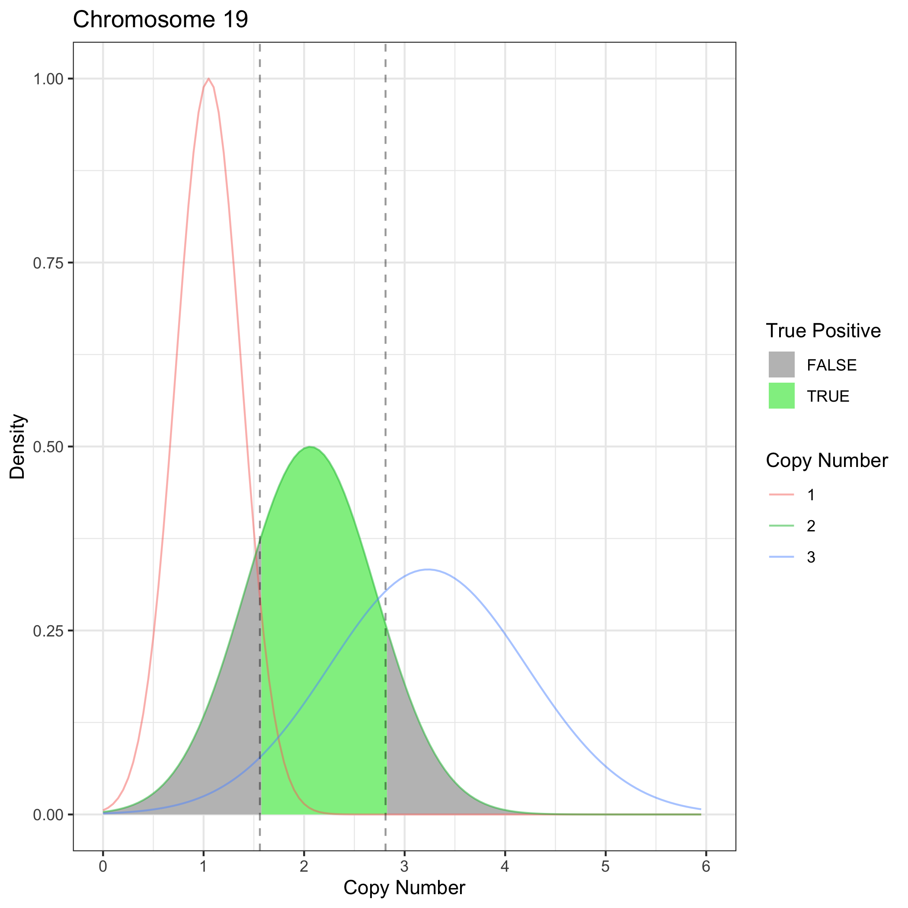

The objective of using Gaussian Mixture Models (GMMs) is to assign discrete copy number values to each chromosome in each cell in a Tapestri experiment in a probabilistic manner, 
such that a "soft" classification is applied, but each cell-chromosome unit has an associated posterior probability of belonging to each copy number bin. 
This allows us to appreciate how a cell-chromosome can be assigned a copy number of 3 (for which it has the highest probability of belonging) but could actually have a copy number of 2 or 4,
and falls within the distribution of possible copy number scores for copy number = 2 or 4. 


```r
library(karyotapR)
library(ggplot2)
library(purrr)
library(forcats)
library(dplyr)
library(fitdistrplus)
library(ggdist)

set.seed(2023)  # seed set for example reproducibility
```


The goal is to generate values that could be expected to have come from diploid cells (in this case, RPE1 cells). 
The first step is to model the counts from each probe as a Weibull distribution.

Take control (near-diploid) cells, normalize counts.


```r
rpe1.bc <- colData(cellmix) %>%
    as_tibble() %>%
    filter(cluster == "RPE1") %>%
    pull(cell.barcode)

raw.data.rpe1 <- assay(cellmix, "counts")[, rpe1.bc]
norm.data.rpe1 <- karyotapR:::.MBNormCounts(raw.data.rpe1)
norm.data.rpe1[norm.data.rpe1 == 0] <- 0.01  #set 0 to 0.01 
norm.data <- as.list(as.data.frame(t(norm.data.rpe1)))
```

Fit weibull distributions to each probe and store distribution parameters.


```r
wfit.ft <- norm.data %>%
    map(~fitdist(data = .x, distr = "weibull"))
wfit <- wfit.ft %>%
    map(~.x$estimate)
```

Diagnostic plots indicate that weibull distribution is a good fit for representative sample of probes.


```r
probe.sample <- sample(1:300, 10)

cowplot::plot_grid(plotlist = map(probe.sample, ~denscomp(list(wfit.ft[[.x]]), main = .x,
    plotstyle = "ggplot") + theme_bw() + theme(legend.position = "none", axis.text.y = element_blank(),
    axis.title = element_blank())), nrow = 2)
```



```r

cowplot::plot_grid(plotlist = map(probe.sample, ~qqcomp(list(wfit.ft[[.x]]), main = .x,
    plotstyle = "ggplot") + theme_bw() + theme(legend.position = "none", axis.text.y = element_blank(),
    axis.title = element_blank())), nrow = 2)
```



```r

cowplot::plot_grid(plotlist = map(probe.sample, ~cdfcomp(list(wfit.ft[[.x]]), main = .x,
    plotstyle = "ggplot") + theme_bw() + theme(legend.position = "none", axis.text.y = element_blank(),
    axis.title = element_blank())), nrow = 2)
```



The fitted parameters correspond to count values expected to be measured by probes for samples that are have copy number = 2 (diploid).
The exceptions are probes targeted to chr10q which have copy number = 3.

We then scale the `scale` parameters of the distributions so that they correspond to copy number = 1, 2, 3, 4, 5, and 6. 
For probes targeting diploid chromosomes, we multiply `scale` by 0.5, 1.0, 1.5, 2.0, 2.5, and 3.0.
For probes with copy number = 3, we multiply `scale` by 0.33, 0.67, 1.0, 1.33, 1.67, and 2.0.

Now, each probe has 6 sets of parameters, each corresponding to a copy number level between 1-6.
For each probe, we generate 500 values according to the distribution parameters, and repeat for each copy number level.
This effectively creates 6 matrices, each containing 500 simulated cells with a count value for each probe. 


```r
cellmix.rpe1 <- cellmix[, rpe1.bc]
control.cn <- generateControlCopyNumberTemplate(cellmix.rpe1, copy.number = 2)
control.cn["chr10q", "copy.number"] <- 3

simulated.cells <- karyotapR:::.generateSimulatedCNVCells(cellmix.rpe1, control.copy.number = control.cn,
    n.simulated.cells = 500)
#> 
ℹ Generating probe values for 500 simulated cells...

✔ Generating probe values for 500 simulated cells... [2.8s]
```

The number of simulated cells is 500 cells per copy number * number of copy number levels = 500 x 6 = 3000


```r
dim(simulated.cells)
#> [1]  317 3000
corner(simulated.cells)
#>            sim_cn1_1 sim_cn1_2 sim_cn1_3 sim_cn1_4 sim_cn1_5
#> AMPL158802 1.2444675 0.2536109 0.6356453 0.7600854 0.5841585
#> AMPL146998 1.5996021 1.0701389 0.5079203 1.4144141 0.7445332
#> AMPL158817 0.2762755 0.7195697 0.9380570 0.2673831 0.8031990
#> AMPL158827 1.3242461 0.8277687 0.6342295 0.4824822 1.4058630
#> AMPL147006 0.7877675 0.8507313 0.5864658 0.9298129 1.3664182
```

The simulated probe values are then smoothed such that each cell-chromosome unit has one smoothed copy number value, as we would do for a normal Tapestri experiment analysis. 
This occurs both at the level of whole chromosome and chromosome arms separately.


```r
simulated.tapestri.experiment <- karyotapR:::.smoothSimulatedCells(normalized.counts = simulated.cells,
    probe.metadata = rowData(cellmix))
```

Visualizing the smoothed copy number values for the simulated cells confirms we have 6 groups of cells, each representing one copy number level across all chromosomes. 


```r
assayHeatmap(simulated.tapestri.experiment, alt.exp = "smoothedCopyNumberByChr",
    assay = "smoothedCopyNumber", split.col.by = "feature.id", split.row.by = "cn.sim.class",
    annotate.row.by = "cn.sim.class", color.preset = "copy.number")
```


For a given chromosome, the simulated values are roughly normally distributed, 
representing the distribution of the expected copy number values that would be measured by our probe panel for cells with true copy number values of 1-6.
Notice that for copy numbers > 2, the spread of the distributions are such that a cell with true copy number = 4, for example, could have a smoothed 
copy number value between ~2.5 and ~5.5, making rounding the value to an integer a problematic way to assign copy number values.

The overlaped regions become larger with fewer probes, as in Chr 19, making the assignment of copy number values less straightforward.


```r
tidy.data <- getTidyData(simulated.tapestri.experiment, alt.exp = "smoothedCopyNumberByChr",
    assay = "smoothedCopyNumber")

tidy.data %>%
    filter(feature.id == 1) %>%
    ggplot(aes(x = smoothedCopyNumber, fill = cn.sim.class)) + geom_density(alpha = 0.4) +
    theme_bw() + scale_x_continuous(breaks = 0:10) + ggtitle("Chromosome 1")
```



```r

tidy.data %>%
    filter(feature.id == 19) %>%
    ggplot(aes(x = smoothedCopyNumber, fill = cn.sim.class)) + geom_density(alpha = 0.4) +
    theme_bw() + scale_x_continuous(breaks = 0:10) + ggtitle("Chromosome 19")
```


To build the Gaussian Mixture Model (GMM) for assigning copy number labels to each cell-chromosome unit, we first
fit Gaussian (normal) distributions to the smoothed copy number values of each chromosome and copy number level.
Each chromosome and copy number level is now represented by the mean and standard deviation parameters of a normal distribution.


```r
cn.model.params.chr <- karyotapR:::.fitGaussianDistributions(simulated.tapestri.experiment = simulated.tapestri.experiment,
    chromosome.scope = "chr")
cn.model.params.chr
#> # A tibble: 138 × 4
#>    feature.id cn.sim.class  mean    sd
#>    <fct>      <fct>        <dbl> <dbl>
#>  1 1          sim_cn1       1.01 0.147
#>  2 1          sim_cn2       2.01 0.301
#>  3 1          sim_cn3       3.01 0.453
#>  4 1          sim_cn4       4.07 0.590
#>  5 1          sim_cn5       5.03 0.762
#>  6 1          sim_cn6       6.01 0.938
#>  7 2          sim_cn1       1.02 0.134
#>  8 2          sim_cn2       2.01 0.272
#>  9 2          sim_cn3       3.03 0.404
#> 10 2          sim_cn4       4.04 0.575
#> # ℹ 128 more rows
```

Based on the normal distribution parameters, we create a Gaussian Mixture Model (GMM) for each chromosome. 
This model covers the expected distribution of smoothed copy number values for the chromosome, for cells with 1-6 copies of the chromosome.

Because the components of the model overlap, assigning an integer copy number value based on `smoothedCopyNumber` is not straight-forward.
For instance, a cell with a `smoothedCopyNumber` value of 3.5 falls under the distributions for copy number = 3, 4, and 5!
To make the call, we calculate the probability that a cell belongs to a copy number component using Bayes Rule, assuming equal priors for 5 components.
Here we are evaluating copy number using a model with components representing copy number = 1, 2, 3, 4, or 5.

The cell is assigned the copy number value for whichever posterior probability is the highest. 


```r
cn.model.table.chr <- karyotapR:::.calcClassPosteriors(TapestriExperiment = cellmix,
    cn.model.params = cn.model.params.chr, model.components = 1:5, model.priors = c(1,
        1, 1, 1, 1), chromosome.scope = "chr")
cn.model.table.chr <- karyotapR:::.callCopyNumberClasses(cn.model.table.chr)
```

Here are the posterior probabilities for 10 cells for chromosome 1. `sim_cn1`, `sim_cn2` etc. are the posterior probabilities that the cell-chromosome unit belongs to each of the five copy number components. 
`cn.class` represents the copy number component for which the posterior probability was the highest.


```r
cbind(cn.model.table.chr$cn.class[[1]][1:10, ], cn.model.table.chr$cn.probability[[1]][1:10,
    ])
#>            cell.barcode cn.class      sim_cn1   sim_cn2    sim_cn3      sim_cn4
#> 1  AACAACCTAATAGTGGTT-1        2 7.877948e-19 0.6590784 0.32893811 0.0108041847
#> 2  AACAACCTAGTCCTAGTT-1        2 8.391042e-06 0.9796430 0.01996909 0.0003265456
#> 3  AACAACCTATGGACGAGA-1        2 2.678006e-17 0.7440963 0.24771740 0.0073667275
#> 4  AACAACTGGGACATAACG-1        3 8.631727e-28 0.1485616 0.79809819 0.0482601422
#> 5  AACAACTGGGGAACCTAG-1        2 1.329662e-02 0.9754359 0.01106268 0.0001695145
#> 6  AACAATGCAATTCACCTC-1        2 2.359324e-21 0.4957158 0.48349360 0.0187845433
#> 7  AACACACTCATACTTGCT-1        2 6.250566e-05 0.9827981 0.01682516 0.0002682120
#> 8  AACAGATCGCCATAGCCA-1        2 8.669628e-05 0.9832327 0.01637546 0.0002600836
#> 9  AACAGCAGTCATTGACAA-1        2 5.210720e-16 0.8035001 0.19068064 0.0052260780
#> 10 AACAGCAGTTCCGATCTG-1        2 1.983447e-08 0.9644437 0.03483694 0.0006302092
#>         sim_cn5
#> 1  1.179297e-03
#> 2  5.296366e-05
#> 3  8.196144e-04
#> 4  5.080044e-03
#> 5  3.525542e-05
#> 6  2.006025e-03
#> 7  4.604722e-05
#> 8  4.509651e-05
#> 9  5.932289e-04
#> 10 8.908706e-05
```

To demonstrate this another way, let's look at a visual.
The "bins" for assigning a smoothed copy number value to a discrete copy number integer can be determined by calculating the boundaries between the copy number components' probability density functions (PDF).
Smoothed copy number values (x-axis) will be assigned to the copy number bin for which it has the highest posterior probability of belonging, which 
is the bin whose boundaries the value falls within. 


```r
getGMMBoundaries(cellmix)
#> # A tibble: 23 × 6
#>    feature.id boundary.1 boundary.2 boundary.3 boundary.4 boundary.5
#>    <fct>           <dbl>      <dbl>      <dbl>      <dbl>      <dbl>
#>  1 1                1.36       2.46       3.51       4.51       5.57
#>  2 2                1.37       2.47       3.54       4.55       5.6 
#>  3 3                1.39       2.47       3.57       4.64       5.69
#>  4 4                1.41       2.49       3.58       4.65       5.74
#>  5 5                1.41       2.49       3.56       4.64       5.7 
#>  6 6                1.38       2.45       3.49       4.57       5.58
#>  7 7                1.39       2.48       3.53       4.58       5.63
#>  8 8                1.39       2.46       3.5        4.55       5.59
#>  9 9                1.38       2.5        3.54       4.61       5.71
#> 10 10               1.38       2.48       3.57       4.61       5.65
#> # ℹ 13 more rows
plotCopyNumberGMM(cellmix, feature.id = 1, draw.boundaries = T)
```



To get a sense of how accurate the model is, we can calculate the theoretical true positive rate for each component, 
i.e. the proportion of the component for which it's values fall within it's boundaries.
Put another way, we want to determine the proportion of cells with true copy number = 2 that would fall within the boundaries for copy number = 2, 
so that they would be assigned copy number = 2. 


```r
chr1 <- plotCopyNumberGMM(cellmix, feature.id = 1, draw.boundaries = T)
chr1.data <- chr1$data %>%
    filter(cn == 2, x < 6)

chr1.data.lines <- chr1$data %>%
    filter(cn %in% 1:3, x < 6)
y.max <- chr1.data.lines %>%
    filter(cn == 2) %>%
    summarize(max(y)) %>%
    unlist()

ggplot(chr1.data) + ggdist::geom_slab(data = chr1.data, mapping = aes(x = x, thickness = y,
    fill = after_stat(x > 1.37 & x < 2.46), scale = y.max)) + theme_bw() + labs(title = paste("Chromosome 1"),
    y = "Density", x = "Copy Number") + scale_x_continuous(limits = c(0, 6), breaks = 0:6) +
    geom_line(data = chr1.data.lines, aes(x = .data$x, y = .data$y, color = .data$cn),
        alpha = 0.5, inherit.aes = F) + geom_vline(xintercept = c(1.37, 2.46), linetype = "dashed",
    alpha = 0.4) + scale_fill_manual(values = c("grey75", "lightgreen")) + labs(fill = "True Positive",
    color = "Copy Number")
```



To calculate the theoretical true positive rate for copy number = 2, 
we calculate the proportion of the area under the curve of the grey sections and subtract them from 1 to get 
the proportion of the area in the green section, 0.93. 
We would expect 93% of cells with true copy number = 2 to be labeled as having copy number = 2.
The remaining 7% would be false negatives with incorrect labels.


```r
lower.p = pnorm(1.37, 2.0551875, 0.2845473, lower.tail = T)
upper.p = pnorm(2.46, 2.0551875, 0.2845473, lower.tail = F)
1 - (lower.p + upper.p)
#> [1] 0.9145616
```

If we repeat for chromosome 19, we can see that the spread of the distribution is greater.
The true positive rate is 65.8%, so the sensitivity for detecting cells with copy number = 2 for chromosome 19 is 
significantly less than for chromosome 2.


```r
chr19 <- plotCopyNumberGMM(cellmix, feature.id = 19, draw.boundaries = T)
chr19.data <- chr19$data %>%
    filter(cn == 2, x < 6)

chr19.data.lines <- chr19$data %>%
    filter(cn %in% 1:3, x < 6)
y.max <- chr19.data.lines %>%
    filter(cn == 2) %>%
    summarize(max(y)) %>%
    unlist()

ggplot(chr19.data) + ggdist::geom_slab(data = chr19.data, mapping = aes(x = x, thickness = y,
    fill = after_stat(x > 1.56 & x < 2.81), scale = y.max)) + theme_bw() + labs(title = paste("Chromosome 19"),
    y = "Density", x = "Copy Number") + scale_x_continuous(limits = c(0, 6), breaks = 0:6) +
    geom_line(data = chr19.data.lines, aes(x = .data$x, y = .data$y, color = .data$cn),
        alpha = 0.5, inherit.aes = F) + geom_vline(xintercept = c(1.56, 2.81), linetype = "dashed",
    alpha = 0.4) + scale_fill_manual(values = c("grey75", "lightgreen")) + labs(fill = "True Positive",
    color = "Copy Number")
```



```r

lower.p = pnorm(1.56, 2.000435, 0.6301878, lower.tail = T)
upper.p = pnorm(2.81, 2.000435, 0.6301878, lower.tail = F)
1 - (lower.p + upper.p)
#> [1] 0.6582322
```


```r
sessioninfo::session_info()
#> ─ Session info ────────────────────────────────────────────────────────────────────────
#>  setting  value
#>  version  R version 4.3.1 (2023-06-16)
#>  os       macOS Ventura 13.5
#>  system   x86_64, darwin20
#>  ui       RStudio
#>  language (EN)
#>  collate  en_US.UTF-8
#>  ctype    en_US.UTF-8
#>  tz       America/New_York
#>  date     2023-09-15
#>  rstudio  2023.06.0+421 Mountain Hydrangea (desktop)
#>  pandoc   3.1.1 @ /Applications/RStudio.app/Contents/Resources/app/quarto/bin/tools/ (via rmarkdown)
#> 
#> ─ Packages ────────────────────────────────────────────────────────────────────────────
#>  package              * version   date (UTC) lib source
#>  abind                  1.4-5     2016-07-21 [1] CRAN (R 4.3.0)
#>  askpass                1.2.0     2023-09-03 [1] CRAN (R 4.3.0)
#>  Biobase              * 2.60.0    2023-05-11 [1] Bioconductor
#>  BiocGenerics         * 0.46.0    2023-05-11 [1] Bioconductor
#>  bitops                 1.0-7     2021-04-24 [1] CRAN (R 4.3.0)
#>  bslib                  0.5.0     2023-06-09 [1] CRAN (R 4.3.0)
#>  cachem                 1.0.8     2023-05-01 [1] CRAN (R 4.3.0)
#>  Cairo                  1.6-0     2022-07-05 [1] CRAN (R 4.3.0)
#>  callr                  3.7.3     2022-11-02 [1] CRAN (R 4.3.0)
#>  circlize               0.4.15    2022-05-10 [1] CRAN (R 4.3.0)
#>  cli                    3.6.1     2023-03-23 [1] CRAN (R 4.3.0)
#>  clue                   0.3-64    2023-01-31 [1] CRAN (R 4.3.0)
#>  cluster                2.1.4     2022-08-22 [1] CRAN (R 4.3.1)
#>  codetools              0.2-19    2023-02-01 [1] CRAN (R 4.3.1)
#>  colorspace             2.1-0     2023-01-23 [1] CRAN (R 4.3.0)
#>  ComplexHeatmap         2.16.0    2023-05-11 [1] Bioconductor
#>  cowplot                1.1.1     2020-12-30 [1] CRAN (R 4.3.0)
#>  crayon                 1.5.2     2022-09-29 [1] CRAN (R 4.3.0)
#>  credentials            1.3.2     2021-11-29 [1] CRAN (R 4.3.0)
#>  curl                   5.0.2     2023-08-14 [1] CRAN (R 4.3.0)
#>  DelayedArray           0.26.7    2023-07-28 [1] Bioconductor
#>  desc                   1.4.2     2022-09-08 [1] CRAN (R 4.3.0)
#>  devtools             * 2.4.5     2022-10-11 [1] CRAN (R 4.3.0)
#>  digest                 0.6.33    2023-07-07 [1] CRAN (R 4.3.0)
#>  distributional         0.3.2     2023-03-22 [1] CRAN (R 4.3.0)
#>  doParallel             1.0.17    2022-02-07 [1] CRAN (R 4.3.0)
#>  downlit                0.4.3     2023-06-29 [1] CRAN (R 4.3.0)
#>  dplyr                * 1.1.3     2023-09-03 [1] CRAN (R 4.3.0)
#>  ellipsis               0.3.2     2021-04-29 [1] CRAN (R 4.3.0)
#>  evaluate               0.21      2023-05-05 [1] CRAN (R 4.3.0)
#>  fansi                  1.0.4     2023-01-22 [1] CRAN (R 4.3.0)
#>  farver                 2.1.1     2022-07-06 [1] CRAN (R 4.3.0)
#>  fastmap                1.1.1     2023-02-24 [1] CRAN (R 4.3.0)
#>  fitdistrplus         * 1.1-11    2023-04-25 [1] CRAN (R 4.3.0)
#>  forcats              * 1.0.0     2023-01-29 [1] CRAN (R 4.3.0)
#>  foreach                1.5.2     2022-02-02 [1] CRAN (R 4.3.0)
#>  formatR                1.14      2023-01-17 [1] CRAN (R 4.3.0)
#>  fs                     1.6.3     2023-07-20 [1] CRAN (R 4.3.0)
#>  generics               0.1.3     2022-07-05 [1] CRAN (R 4.3.0)
#>  GenomeInfoDb         * 1.36.2    2023-08-25 [1] Bioconductor
#>  GenomeInfoDbData       1.2.10    2023-07-09 [1] Bioconductor
#>  GenomicRanges        * 1.52.0    2023-05-11 [1] Bioconductor
#>  gert                   1.9.2     2022-12-05 [1] CRAN (R 4.3.0)
#>  GetoptLong             1.0.5     2020-12-15 [1] CRAN (R 4.3.0)
#>  ggdist               * 3.3.0     2023-05-13 [1] CRAN (R 4.3.0)
#>  ggplot2              * 3.4.3     2023-08-14 [1] CRAN (R 4.3.0)
#>  gh                     1.4.0     2023-02-22 [1] CRAN (R 4.3.0)
#>  gitcreds               0.1.2     2022-09-08 [1] CRAN (R 4.3.0)
#>  GlobalOptions          0.1.2     2020-06-10 [1] CRAN (R 4.3.0)
#>  glue                   1.6.2     2022-02-24 [1] CRAN (R 4.3.0)
#>  gtable                 0.3.4     2023-08-21 [1] CRAN (R 4.3.0)
#>  gtools                 3.9.4     2022-11-27 [1] CRAN (R 4.3.0)
#>  highr                  0.10      2022-12-22 [1] CRAN (R 4.3.0)
#>  htmltools              0.5.5     2023-03-23 [1] CRAN (R 4.3.0)
#>  htmlwidgets            1.6.2     2023-03-17 [1] CRAN (R 4.3.0)
#>  httpuv                 1.6.11    2023-05-11 [1] CRAN (R 4.3.0)
#>  httr2                  0.2.3     2023-05-08 [1] CRAN (R 4.3.0)
#>  IRanges              * 2.34.1    2023-06-22 [1] Bioconductor
#>  iterators              1.0.14    2022-02-05 [1] CRAN (R 4.3.0)
#>  jquerylib              0.1.4     2021-04-26 [1] CRAN (R 4.3.0)
#>  jsonlite               1.8.7     2023-06-29 [1] CRAN (R 4.3.0)
#>  karyotapR            * 1.0.1     2023-09-07 [1] CRAN (R 4.3.1)
#>  knitr                  1.43      2023-05-25 [1] CRAN (R 4.3.0)
#>  labeling               0.4.3     2023-08-29 [1] CRAN (R 4.3.0)
#>  later                  1.3.1     2023-05-02 [1] CRAN (R 4.3.0)
#>  lattice                0.21-8    2023-04-05 [1] CRAN (R 4.3.1)
#>  lifecycle              1.0.3     2022-10-07 [1] CRAN (R 4.3.0)
#>  magick                 2.7.4     2023-03-09 [1] CRAN (R 4.3.0)
#>  magrittr               2.0.3     2022-03-30 [1] CRAN (R 4.3.0)
#>  MASS                 * 7.3-60    2023-05-04 [1] CRAN (R 4.3.1)
#>  Matrix                 1.6-0     2023-07-08 [1] CRAN (R 4.3.0)
#>  MatrixGenerics       * 1.12.3    2023-07-31 [1] Bioconductor
#>  matrixStats          * 1.0.0     2023-06-02 [1] CRAN (R 4.3.0)
#>  memoise                2.0.1     2021-11-26 [1] CRAN (R 4.3.0)
#>  mime                   0.12      2021-09-28 [1] CRAN (R 4.3.0)
#>  miniUI                 0.1.1.1   2018-05-18 [1] CRAN (R 4.3.0)
#>  munsell                0.5.0     2018-06-12 [1] CRAN (R 4.3.0)
#>  openssl                2.1.0     2023-07-15 [1] CRAN (R 4.3.0)
#>  pillar                 1.9.0     2023-03-22 [1] CRAN (R 4.3.0)
#>  pkgbuild               1.4.2     2023-06-26 [1] CRAN (R 4.3.0)
#>  pkgconfig              2.0.3     2019-09-22 [1] CRAN (R 4.3.0)
#>  pkgdown                2.0.7     2022-12-14 [1] CRAN (R 4.3.0)
#>  pkgload                1.3.2.1   2023-07-08 [1] CRAN (R 4.3.0)
#>  png                    0.1-8     2022-11-29 [1] CRAN (R 4.3.0)
#>  prettyunits            1.1.1     2020-01-24 [1] CRAN (R 4.3.0)
#>  processx               3.8.2     2023-06-30 [1] CRAN (R 4.3.0)
#>  profvis                0.3.8     2023-05-02 [1] CRAN (R 4.3.0)
#>  promises               1.2.0.1   2021-02-11 [1] CRAN (R 4.3.0)
#>  ps                     1.7.5     2023-04-18 [1] CRAN (R 4.3.0)
#>  purrr                * 1.0.2     2023-08-10 [1] CRAN (R 4.3.0)
#>  R6                     2.5.1     2021-08-19 [1] CRAN (R 4.3.0)
#>  rappdirs               0.3.3     2021-01-31 [1] CRAN (R 4.3.0)
#>  RColorBrewer           1.1-3     2022-04-03 [1] CRAN (R 4.3.0)
#>  Rcpp                   1.0.11    2023-07-06 [1] CRAN (R 4.3.0)
#>  RCurl                  1.98-1.12 2023-03-27 [1] CRAN (R 4.3.0)
#>  remotes                2.4.2.1   2023-07-18 [1] CRAN (R 4.3.0)
#>  rhdf5                  2.44.0    2023-05-11 [1] Bioconductor
#>  rhdf5filters           1.12.1    2023-05-11 [1] Bioconductor
#>  Rhdf5lib               1.22.0    2023-05-11 [1] Bioconductor
#>  rjson                  0.2.21    2022-01-09 [1] CRAN (R 4.3.0)
#>  rlang                  1.1.1     2023-04-28 [1] CRAN (R 4.3.0)
#>  rmarkdown              2.23      2023-07-01 [1] CRAN (R 4.3.0)
#>  rprojroot              2.0.3     2022-04-02 [1] CRAN (R 4.3.0)
#>  rstudioapi             0.15.0    2023-07-07 [1] CRAN (R 4.3.0)
#>  S4Arrays               1.0.6     2023-08-30 [1] Bioconductor
#>  S4Vectors            * 0.38.1    2023-05-11 [1] Bioconductor
#>  sass                   0.4.7     2023-07-15 [1] CRAN (R 4.3.0)
#>  scales                 1.2.1     2022-08-20 [1] CRAN (R 4.3.0)
#>  sessioninfo            1.2.2     2021-12-06 [1] CRAN (R 4.3.0)
#>  shape                  1.4.6     2021-05-19 [1] CRAN (R 4.3.0)
#>  shiny                  1.7.4.1   2023-07-06 [1] CRAN (R 4.3.0)
#>  SingleCellExperiment * 1.22.0    2023-05-11 [1] Bioconductor
#>  stringi                1.7.12    2023-01-11 [1] CRAN (R 4.3.0)
#>  stringr                1.5.0     2022-12-02 [1] CRAN (R 4.3.0)
#>  SummarizedExperiment * 1.30.2    2023-06-06 [1] Bioconductor
#>  survival             * 3.5-5     2023-03-12 [1] CRAN (R 4.3.1)
#>  sys                    3.4.2     2023-05-23 [1] CRAN (R 4.3.0)
#>  tibble                 3.2.1     2023-03-20 [1] CRAN (R 4.3.0)
#>  tidyr                  1.3.0     2023-01-24 [1] CRAN (R 4.3.0)
#>  tidyselect             1.2.0     2022-10-10 [1] CRAN (R 4.3.0)
#>  urlchecker             1.0.1     2021-11-30 [1] CRAN (R 4.3.0)
#>  usethis              * 2.2.2     2023-07-06 [1] CRAN (R 4.3.0)
#>  utf8                   1.2.3     2023-01-31 [1] CRAN (R 4.3.0)
#>  vctrs                  0.6.3     2023-06-14 [1] CRAN (R 4.3.0)
#>  viridisLite            0.4.2     2023-05-02 [1] CRAN (R 4.3.0)
#>  whisker                0.4.1     2022-12-05 [1] CRAN (R 4.3.0)
#>  withr                  2.5.0     2022-03-03 [1] CRAN (R 4.3.0)
#>  xfun                   0.39      2023-04-20 [1] CRAN (R 4.3.0)
#>  xml2                   1.3.5     2023-07-06 [1] CRAN (R 4.3.0)
#>  xtable                 1.8-4     2019-04-21 [1] CRAN (R 4.3.0)
#>  XVector                0.40.0    2023-05-11 [1] Bioconductor
#>  yaml                   2.3.7     2023-01-23 [1] CRAN (R 4.3.0)
#>  zlibbioc               1.46.0    2023-05-11 [1] Bioconductor
#> 
#>  [1] /Library/Frameworks/R.framework/Versions/4.3-x86_64/Resources/library
#> 
#> ───────────────────────────────────────────────────────────────────────────────────────
```
